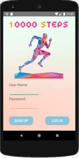

# StepCounterApp
## Introduction
According to the research, the adults are supposed to take walk 10000 steps to maintain health or lose weight per day. My app is like a step counter, which encourages
the users to walk. The user can set up their own goal. Once the users have reached their goal or 1000 steps, the app will notify the users. I made a circle progress indicator to show the relationship between the current steps and the goal. In addition, the users can check their current location through the map.
## Implemented Features
- Sign Up & Log in.
- Database for steps and date.
- Circle progress indicator for step counter.
- Notification.
- Map to show the current location.
- Allow users to customize the indicator’s colour, text size and whether use animation\

